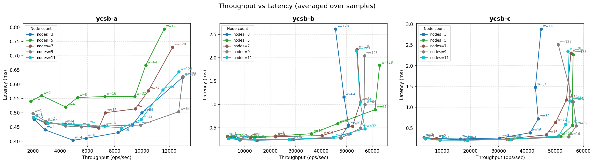

# Hermes

[English version here](README.md)

**Hermes** 無効化ベース分散キーバリューストアプロトコルの Go 実装です。

Hermes はキーごとの状態機械（Valid / Invalid / Trans）を全レプリカで管理することで、**1ラウンドトリップの write** と**ローカル read** を実現します。read は常にローカルで処理し、write はまずリモートのコピーを無効化してから、検証ブロードキャストでコミットします。

## プロトコルの概要

```
クライアント     コーディネーター           レプリカ
    |                  |                     |
    |--- WRITE ------->|                     |
    |                  |--- INV ------------>|  (StateInvalid)
    |                  |<-- ACK -------------|
    |                  |--- VAL ------------>|  (StateValid, 新しい値)
    |<-- Response -----|                     |
```

- **WRITE**: クライアントがキーのコーディネーター（`fnv32a(key) % N` で決定）に送信
- **INV**: コーディネーターは自身のキー状態を `StateTrans` にし、全レプリカへ無効化を一斉送信
- **ACK**: 各レプリカはキーを `StateInvalid` にしてから応答
- **VAL**: 全 ACK が揃ったらコーディネーターが値をコミットし、検証を一斉送信してクライアントに返信
- **READ**: ローカルで処理。キーが `StateInvalid` または `StateTrans` の場合は次の VAL が届くまでブロック

## Safety 保証

- **Stale read なし**: INV を受け取ったレプリカは古い値を返しません。対応する VAL が届くまで read をブロックします。
- **合意（Agreement）**: write がクライアントに ACK された後は、クラスター内の全ノードがコミット済みの値を返します。
- **Stale-INV 保護**: 同じキーへの並列 write はキーごとのコミット済みシーケンス番号（`kseq`）で安全に処理されます。古い write からの遅延 INV は無視され、レプリカが `StateInvalid` に詰まる問題を防ぎます。

## ファイル構成

```
hermes.go        HermesNode 構造体、キー状態型、NewHermesNode
conns.go         プロトコルハンドラー（handleWrite/INV/ACK/VAL/Read）と UDP I/O
client.go        ベンチマーククライアント（Put / Get、YCSB ワークロード）
config.go        クラスター設定パーサー（JSON）
init.go          CLI エントリーポイント（urfave/cli）
message.go       バイナリメッセージのエンコード/デコード
safety_test.go   Safety 特性テスト
cluster.conf     3ノードクラスターの設定例
makefile         build / start / kill / benchmark ターゲット
```

## はじめかた

### 必要なもの

- Go 1.22 以上
- `jq`（benchmark make ターゲットで使用）

### ビルド

```sh
make build
```

### ローカル 3ノードクラスターの起動

```sh
# cluster.conf に定義された全ノードを起動
make start

# デバッグログ付きで起動
make start DEBUG=true

# 全ノードを停止
make kill
```

### ノードを手動で起動する場合

```sh
./hermes_server start --id 1 --conf cluster.conf
```

### クラスター設定ファイルの形式（`cluster.conf`）

```json
[
  { "id": 0, "ip": "localhost", "port": 4999, "role": "client" },
  { "id": 1, "ip": "localhost", "port": 5000, "role": "server" },
  { "id": 2, "ip": "localhost", "port": 5001, "role": "server" },
  { "id": 3, "ip": "localhost", "port": 5002, "role": "server" }
]
```

`"role": "client"` のエントリーはちょうど1つ必要です（ベンチマーククライアントのリッスンアドレス）。それ以外は全てサーバーノードです。

## ベンチマーク

```sh
# YCSB-A（write 50%）、ワーカー1、キー6個
make benchmark TYPE=ycsb-a WORKERS=1 KEYS=6

# ワーカー数・キー数を複数組み合わせてスイープ
make benchmark TYPE=ycsb-b WORKERS="1 2 4 8" KEYS="6 100"
```

結果は CSV として `results/benchmark_<タイムスタンプ>_<タイプ>.csv` に保存されます。

| ワークロード | write 比率 |
|------------|------------|
| ycsb-a     | 50%        |
| ycsb-b     | 5%         |
| ycsb-c     | 0%（read のみ） |

## 実験環境

- 現在のベンチマーク結果・プロットは単一マシン上で取得しています。
- **分散環境（複数ホスト間のネットワーク）ではありません。**

## 実験プロット



## テスト

```sh
go test -v ./...
```

`safety_test.go` にはコアの safety 不変条件を検証するテストが含まれます。

| テスト | 検証内容 |
|--------|---------|
| `TestReadBlockedWhileStateInvalid` | StateInvalid のレプリカで read が VAL 受信までブロックされること |
| `TestReadBlockedWhileStateTrans` | StateTrans のコーディネーターで read が write 完了までブロックされること |
| `TestWriteVisibleOnAllNodesAfterAck` | write ACK 後、全ノードがコミット済みの値を返すこと |
| `TestMonotonicWritesAcrossNodes` | 順次 write が各 ACK 後に全ノードで反映されること |
| `TestConcurrentWritesDifferentKeys` | 異なるキーへの並列 write が全て正常にコミットされること |
| `TestConcurrentWritesSameKey` | 同じキーへの並列 write がクラスター全体で一つの値に収束すること（split-brain なし） |

## 参考文献

- Katsarakis et al., *[Hermes: A Fast, Fault-Tolerant and Linearizable Replication Protocol](https://dl.acm.org/doi/10.1145/3373376.3378496)*, ASPLOS 2020
