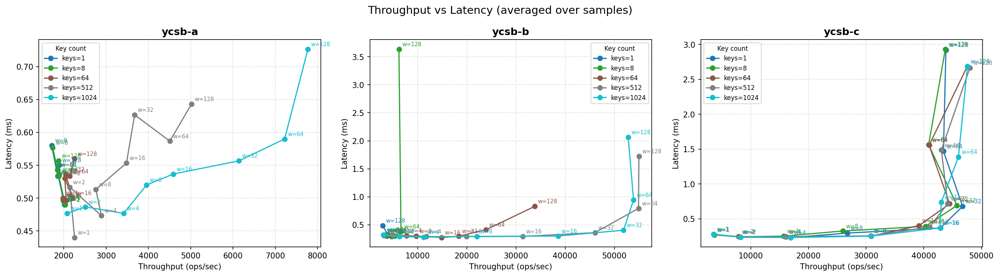

# Hermes

[日本語版はこちら](README.ja.md)

A Go implementation of the **Hermes** invalidation-based distributed key-value store protocol.

Hermes achieves one-round-trip writes with local reads by maintaining a per-key state machine (Valid / Invalid / Trans) across all replicas. Reads are always served locally; writes invalidate remote copies first, then commit with a validation broadcast.

## Protocol overview

```
Client          Coordinator             Replicas
  |                  |                     |
  |--- WRITE ------->|                     |
  |                  |--- INV ------------>|  (StateInvalid)
  |                  |<-- ACK -------------|
  |                  |--- VAL ------------>|  (StateValid, new value)
  |<-- Response -----|                     |
```

- **WRITE**: client sends to the coordinator for the key (determined by `fnv32a(key) % N`)
- **INV**: coordinator marks the key as `StateTrans` locally and broadcasts invalidations to all replicas
- **ACK**: each replica marks the key as `StateInvalid` and acknowledges
- **VAL**: once all ACKs are collected, the coordinator commits the value, broadcasts validation, and replies to the client
- **READ**: served locally; stalls if the key is in `StateInvalid` or `StateTrans` until the next VAL arrives

## Safety guarantees

- **No stale reads**: a replica that has received an INV never returns the old value. Reads block until the corresponding VAL is delivered.
- **Agreement**: after a write is acknowledged to the client, every node in the cluster returns the committed value.
- **Stale-INV protection**: concurrent writes to the same key are handled safely via a per-key committed-sequence watermark (`kseq`). Late INVs from superseded writes are silently dropped, preventing replicas from getting stuck in `StateInvalid`.

## Project structure

```
hermes.go        HermesNode struct, key-state types, NewHermesNode
conns.go         Protocol handlers (handleWrite/INV/ACK/VAL/Read) and UDP I/O
client.go        Benchmark client (Put / Get, YCSB workloads)
config.go        Cluster config parser (JSON)
init.go          CLI entry point (urfave/cli)
message.go       Binary message encode/decode
safety_test.go   Safety property tests
cluster.conf     Example 3-node cluster config
makefile         Build, start, kill, benchmark targets
```

## Getting started

### Requirements

- Go 1.22+
- `jq` (for the benchmark make target)

### Build

```sh
make build
```

### Run a local 3-node cluster

```sh
# Start all nodes defined in cluster.conf
make start

# Start with debug logging
make start DEBUG=true

# Stop all nodes
make kill
```

### Run a single node manually

```sh
./hermes_server start --id 1 --conf cluster.conf
```

### Cluster config format (`cluster.conf`)

```json
[
  { "id": 0, "ip": "localhost", "port": 4999, "role": "client" },
  { "id": 1, "ip": "localhost", "port": 5000, "role": "server" },
  { "id": 2, "ip": "localhost", "port": 5001, "role": "server" },
  { "id": 3, "ip": "localhost", "port": 5002, "role": "server" }
]
```

Exactly one entry must have `"role": "client"` (the benchmark client's listen address). All other entries are server nodes.

## Benchmarking

```sh
# YCSB-A (50% writes), 1 worker, 6 keys
make benchmark TYPE=ycsb-a WORKERS=1 KEYS=6

# Sweep over multiple worker counts and key counts
make benchmark TYPE=ycsb-b WORKERS="1 2 4 8" KEYS="6 100"
```

Results are written as CSV to `results/benchmark_<timestamp>_<type>.csv`.

| Workload | Write ratio |
|----------|-------------|
| ycsb-a   | 50%         |
| ycsb-b   | 5%          |
| ycsb-c   | 0% (read-only) |

## Experiment environment

- The current benchmark results and plots were collected on a single machine.
- This is **not** a distributed deployment (no multi-host network environment).

## Experiment plot



## Testing

```sh
go test -v ./...
```

The `safety_test.go` file verifies the core safety invariants:

| Test | What it checks |
|------|---------------|
| `TestReadBlockedWhileStateInvalid` | Reads block on a replica in StateInvalid until VAL arrives |
| `TestReadBlockedWhileStateTrans` | Reads block on the coordinator in StateTrans until the write commits |
| `TestWriteVisibleOnAllNodesAfterAck` | After a write ACK, all nodes return the committed value |
| `TestMonotonicWritesAcrossNodes` | Sequential writes are visible on every node after each ACK |
| `TestConcurrentWritesDifferentKeys` | Parallel writes to distinct keys all commit correctly |
| `TestConcurrentWritesSameKey` | Concurrent writes to one key converge to a single agreed value (no split-brain) |

## References

- Kalia et al., *[Hermes: A Fast, Fault-Tolerant and Linearizable Replication Protocol](https://dl.acm.org/doi/10.1145/3373376.3378496)*, ASPLOS 2020
